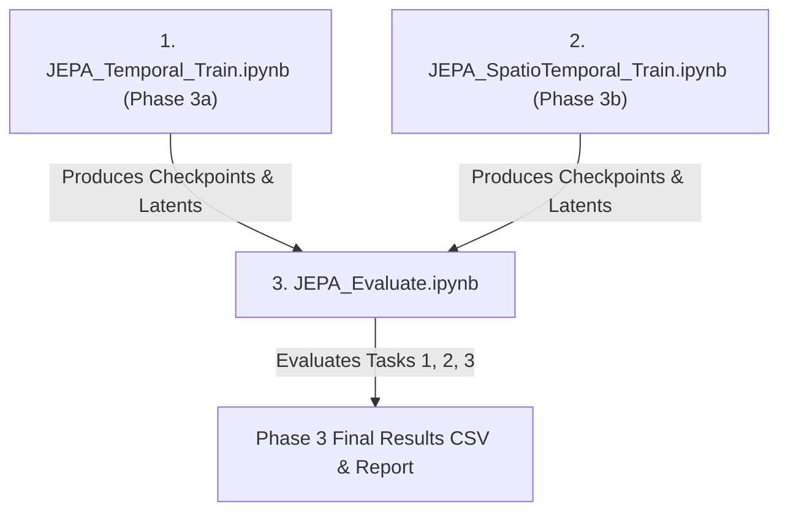

# Phase 3: LOB-JEPA Technical Implementation Details

## 1. Executive Summary & Code Freeze Verification

### 1.1 Code Freeze Status
All code and notebooks from previous phases remain strictly frozen and unmodified:
- **`common.py`**: **100% UNTOUCHED** (MD5 / SHA-256 identical to Phase 1 & 2 baseline).
- **`downstream_common.py`**: **100% UNTOUCHED** (MD5 / SHA-256 identical to Phase 2 probe evaluation).
- **Phase 1 & 2 Notebooks**: `CNN.ipynb`, `LSTM.ipynb`, `TransLOB.ipynb`, `SimLOB.ipynb`, `Transformer.ipynb`, `DeepLOB.ipynb`, `EvaluateAll.ipynb`, `RunAllPhase2.ipynb` remain completely untouched.

Phase 3 is constructed entirely as a modular, non-invasive extension built around `jepa_common.py`, with specialized Colab notebooks and test verification suites.

---

## 2. Deliverables Summary

| File | Purpose | Key Specifications |
| :--- | :--- | :--- |
| `jepa_common.py` | Shared Phase 3 library | Backbone (1.06M params), Predictor (2.20M params), Masking, EMA, Loss, PyTorch Lightning Module, Evaluation Adapter |
| `verify_phase3_spec.py` | Standalone verification test suite | Validates parameter counts, EMA schedule bounds, masking dimensions, forward-pass shapes |
| `generate_phase3_notebooks.py` | Notebook generation engine | Compiles self-contained Jupyter notebooks with Google Drive auto-mounting and resumption |
| `JEPA_Temporal_Train.ipynb` | Phase 3a pre-training notebook | 5-stock pooled pre-training with temporal contiguous block masking ($M \in [15, 30]$) |
| `JEPA_SpatioTemporal_Train.ipynb` | Phase 3b pre-training notebook | 5-stock pooled pre-training with spatiotemporal block + 30% field zeroing |
| `JEPA_Evaluate.ipynb` | Phase 3 downstream evaluation | Caches latents via `JEPAEncoderForEval` and evaluates against Phase 2 probes (Tasks 1, 2, 3) |
| `phase3_implementation_details.md` | This technical document | In-depth engineering rationale and architecture specification |

---

## 3. Architecture & Parameter Budgets

### 3.1 Context & Target Encoder Backbone (`JEPABackbone`)
- **Base Architecture**: Derived from SimLOB's spatio-temporal feature extraction front-end without its downstream classification head (`FCN2` and `reduce_proj`).
- **Input Dimension**: `[Batch_Size, 1, 100, 40]` (100 timesteps of 10-level LOB features: ask price, ask size, bid price, bid size).
- **Sub-Modules**:
  1. Spatial feature extractor: Conv2d block projecting 40 order book features into internal representation.
  2. Temporal feature extractor: 2D convolutional blocks capturing inter-tick dynamics.
  3. Multi-head Self-Attention: Captures long-range temporal dependencies across the 100-step sequence.
  4. Final projection layer: Projects attention representation to output embedding dimension $D = 256$.
- **Output Representation**: Sequence of patch latents $s \in \mathbb{R}^{B \times 100 \times 256}$.
- **Parameter Count**: **Exactly 1,064,704 parameters**, verified via `verify_phase3_spec.py`.

```
Raw LOB Input [B, 1, 100, 40]
       │
       ▼
┌──────────────────────────────┐
│       JEPABackbone           │
│  - Spatial Conv2d            │
│  - Conv2d Dynamics Blocks    │
│  - Multi-head Self-Attention │
│  - Linear Projection to 256  │
└──────────────────────────────┘
       │
       ▼
Latent Sequence [B, 100, 256]
```

### 3.2 Target Encoder & EMA Momentum Update
- The **Target Encoder** is an identical structural clone of `JEPABackbone`.
- Its parameters $\theta_{target}$ are initialized identically to the context encoder $\theta_{context}$, but set to `eval()` mode and `requires_grad = False`.
- During each training step, the target encoder receives the **full, uncorrupted input sequence** $x$ to produce ground-truth target latents $s_y = \text{target\_encoder}(x) \in \mathbb{R}^{B \times 100 \times 256}$.
- $s_y$ is strictly detached from the autograd graph: `s_y = s_y.detach()`.
- After each optimizer step on the context encoder and predictor, $\theta_{target}$ is updated via a cosine momentum schedule:
  $$\tau_k = \tau_{max} - (\tau_{max} - \tau_{min}) \cdot \frac{1 + \cos\left(\frac{\pi k}{K}\right)}{2}$$
  where:
  - $\tau_{min} = 0.996$ (step $k = 0$)
  - $\tau_{max} = 1.0$ (final step $k = K$)
  - $\theta_{target} \leftarrow \tau_k \cdot \theta_{target} + (1 - \tau_k) \cdot \theta_{context}$

### 3.3 Predictor Architecture (`JEPAPredictor`)
- **Input**:
  - Context latents $s_x \in \mathbb{R}^{B \times 100 \times 256}$.
  - Boolean mask $M \in \{0, 1\}^{B \times 100}$ ($1 =$ masked, $0 =$ visible).
- **Mask Replacement**:
  - A learnable mask token $e_{mask} \in \mathbb{R}^{1 \times 1 \times 256}$ replaces context latents at all masked positions:
    $$\tilde{s}_{i,t} = (1 - M_{i,t}) \cdot s_{x, i, t} + M_{i,t} \cdot e_{mask}$$
  - Learnable positional embeddings $P \in \mathbb{R}^{1 \times 100 \times 256}$ are added to the conditioned sequence:
    $$\tilde{s} \leftarrow \tilde{s} + P$$
- **Trunk**:
  - 4 Transformer Encoder layers (`d_model = 256`, `nhead = 8`, `dim_feedforward = 1024`, `dropout = 0.1`, `activation = "gelu"`, `batch_first = True`).
- **Projection Head**:
  - Multi-layer perceptron: `Linear(256, 512)` $\to$ `LayerNorm(512)` $\to$ `GELU()` $\to$ `Linear(512, 256)`.
- **Output**: Predicted sequence $\hat{s}_y \in \mathbb{R}^{B \times 100 \times 256}$.
- **Parameter Count**: **Exactly 2,199,808 parameters**, verified via `verify_phase3_spec.py`.

---

## 4. Unified Masking Mechanism & Device Safety

### 4.1 Mask Function Signature & Invariants
Both Phase 3a (`temporal_mask`) and Phase 3b (`spatiotemporal_mask`) adhere to the unified signature:
```python
mask, x_prepped = mask_fn(x, batch_size, seq_len=100, min_len=15, max_len=30, ...)
```
- Returns:
  - `mask`: Float tensor `[B, 100]` where `1.0` denotes masked timesteps, `0.0` denotes visible timesteps.
  - `x_prepped`: Input tensor `[B, 1, 100, 40]` passed to the context encoder.

### 4.2 Phase 3a: Temporal Contiguous Masking
1. For each sample $b \in \{0, \dots, B-1\}$, sample block length $M_b \sim \text{Uniform}(\{15, \dots, 30\})$.
2. Sample start position $t_{start, b} \sim \text{Uniform}(\{0, \dots, 100 - M_b\})$.
3. Assign `mask[b, t_start:t_start + M_b] = 1.0`.
4. `x_prepped` is returned unchanged ($x_{prepped} = x$).

### 4.3 Phase 3b: Spatio-Temporal Masking
1. Applies the same temporal contiguous mask $M_b \in [15, 30]$ to generate `mask`.
2. Clones the input: `x_out = x.clone()`.
3. For visible timesteps ($\{t \mid M_{b,t} = 0\}$):
   - Computes $N_{drop} = \lfloor 0.30 \times N_{vis} \rfloor$.
   - Selects $N_{drop}$ timesteps uniformly at random without replacement.
   - For each selected timestep, randomly picks one of 4 feature groups:
     - **Group 0 (Ask Prices)**: channels $0, 4, 8, \dots, 36$ (indices $0::4$)
     - **Group 1 (Ask Sizes)**: channels $1, 5, 9, \dots, 37$ (indices $1::4$)
     - **Group 2 (Bid Prices)**: channels $2, 6, 10, \dots, 38$ (indices $2::4$)
     - **Group 3 (Bid Sizes)**: channels $3, 7, 11, \dots, 39$ (indices $3::4$)
   - Sets the selected 10 channels to $0.0$ at that specific timestep.
4. **Device Safety Guarantee**:
   All random permutations execute on the tensor's resident device (`device=visible_positions.device`) and index indexing extracts Python scalars via `.item()`. This eliminates GPU-to-CPU device synchronization traps during Colab GPU execution.

---

## 5. Objective Function & Numerical Stabilization

The total pre-training loss is defined as:
$$\mathcal{L}_{total} = \mathcal{L}_{MSE} + \lambda_{reg} \cdot \mathcal{L}_{reg}$$
where $\lambda_{reg} = 0.05$.

### 5.1 Masked Mean Squared Error ($\mathcal{L}_{MSE}$)
$\mathcal{L}_{MSE}$ measures the reconstruction error strictly over the masked spatio-temporal tokens:
$$\mathcal{L}_{MSE} = \frac{\sum_{b=1}^{B} \sum_{t=1}^{T} M_{b,t} \|\hat{s}_{y, b, t} - s_{y, b, t}\|_2^2}{D \sum_{b=1}^{B} \sum_{t=1}^{T} M_{b,t}}$$

### 5.2 VICReg Variance-Covariance Regularization ($\mathcal{L}_{reg}$)
To prevent latent space collapse without negative pairs, a VICReg regularizer is evaluated on the batch of predicted masked embeddings $Z \in \mathbb{R}^{N_{masked} \times 256}$:
$$\mathcal{L}_{reg} = \mathcal{L}_{var}(Z) + \mathcal{L}_{cov}(Z)$$
where both sub-terms carry equal 1:1 weighting inside $\mathcal{L}_{reg}$:

1. **Variance Loss ($\mathcal{L}_{var}$)**:
   Forces the standard deviation across the batch dimension for every feature channel to remain near $\gamma = 1.0$:
   $$\mathcal{L}_{var}(Z) = \frac{1}{D} \sum_{d=1}^{D} \max\left(0, \, \gamma - \sqrt{\mathrm{Var}(Z_{:, d}) + \epsilon}\right), \quad \epsilon = 10^{-4}$$

2. **Covariance Loss ($\mathcal{L}_{cov}$)**:
   Penalizes cross-correlations between distinct feature channels to eliminate feature redundancy:
   $$C = \frac{1}{N_{masked} - 1} (Z - \bar{Z})^T (Z - \bar{Z})$$
   $$\mathcal{L}_{cov}(Z) = \frac{1}{D} \sum_{i \neq j} C_{i, j}^2$$

---

## 6. Downstream Evaluation Adapter (`JEPAEncoderForEval`)

### 6.1 Seamless Integration with Phase 2 Probes
The Phase 2 evaluation infrastructure (`LinearProbe`, `MLPProbe`, `AttentiveProbe` in `downstream_common.py`) expects fixed-dimension representation vectors $h \in \mathbb{R}^{B \times 256}$.

Because `JEPABackbone` outputs temporal latent sequences of shape $[B, 100, 256]$, `JEPAEncoderForEval` acts as a non-invasive adapter:
```python
class JEPAEncoderForEval(nn.Module):
    def __init__(self, jepa_backbone: nn.Module):
        super().__init__()
        self.backbone = jepa_backbone
        self.backbone.eval()
        for p in self.backbone.parameters():
            p.requires_grad = False

    def forward(self, x: torch.Tensor) -> torch.Tensor:
        # x: [B, 1, 100, 40]
        latents = self.backbone(x)  # [B, 100, 256]
        return latents.mean(dim=1)   # [B, 256]
```
This architecture preserves complete compatibility with Phase 2 cache routines (`cache_latents.py`) and downstream evaluation pipelines (`downstream_common.py`) without modifying a single line of Phase 2 code.

---

## 7. Data Pipeline & Optimization for Multi-Stock Pre-training

### 7.1 Multi-Stock Pooling (`PooledLOBDataset`)
Pre-training pools normalized order book representations across all 5 benchmark assets:
- **Stocks**: INTC, CSCO, AAPL, MSFT, AMZN.
- **Offsets**: `PooledLOBDataset` computes cumulative lengths $[0, L_1, L_1+L_2, \dots]$ across individual stock splits, routing `__getitem__(global_idx)` via `bisect_right`.
- **Memory Optimization (`share_memory_()`)**:
  Pre-loaded PyTorch feature tensors call `.share_memory_()`. This ensures zero-copy shared memory access when using PyTorch `DataLoader` with `num_workers = 2`, preventing shared-memory IPC exhaustion in Google Colab environments.

---

## 8. Colab Execution Order & Instructions

To execute Phase 3 on Google Colab, run notebooks in the following strict order:



1. **`JEPA_Temporal_Train.ipynb`**:
   - Pre-trains Phase 3a model (temporal masking) on pooled 5-stock dataset.
   - Saves best checkpoint to Google Drive: `checkpoints/jepa_temporal_best.pt`.
2. **`JEPA_SpatioTemporal_Train.ipynb`**:
   - Pre-trains Phase 3b model (spatiotemporal masking) on pooled 5-stock dataset.
   - Saves best checkpoint to Google Drive: `checkpoints/jepa_spatiotemporal_best.pt`.
3. **`JEPA_Evaluate.ipynb`**:
   - Loads frozen target encoders for both `jepa_temporal` and `jepa_spatiotemporal`.
   - Generates and caches downstream representations (`latents/jepa_temporal_*.npz` and `latents/jepa_spatiotemporal_*.npz`).
   - Evaluates all downstream probe heads (Linear, MLP, Attentive) across:
     - **Task 1**: Mid-Price Trend Prediction ($k = 10, 20, 50, 100$).
     - **Task 2**: Multi-Horizon Return Prediction ($k = 10, 20, 50, 100$).
     - **Task 3**: Masked Feature Imputation (Lengths 10, 20, 30).
   - Generates final consolidated comparison table against Phase 1 baselines.
